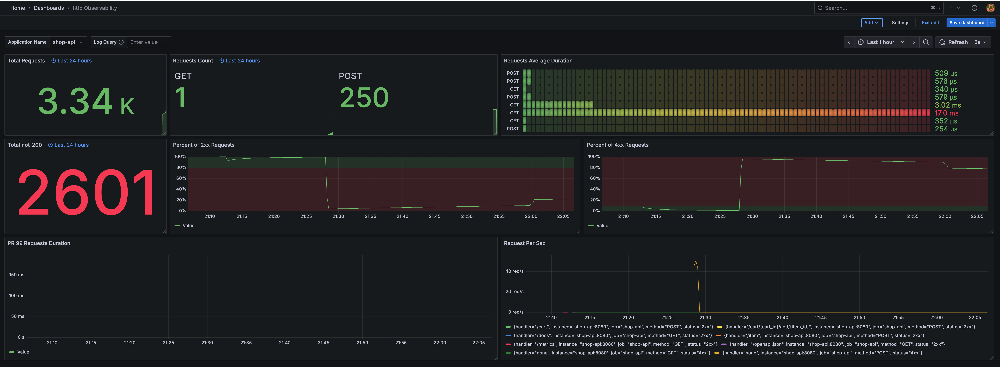
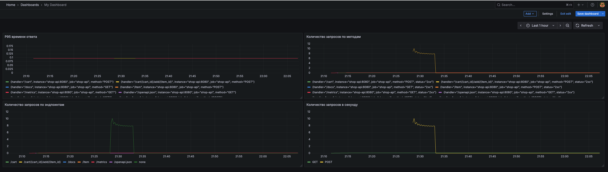

# Docker и Мониторинг для Shop API

Этот файл содержит инструкции по запуску Shop API в Docker с мониторингом через Prometheus и Grafana.

## Структура

```
hw2/hw/
├── Dockerfile                  # Образ Docker для Shop API
├── docker-compose.yml          # Оркестрация всех сервисов
├── settings/
│   └── prometheus/
│       └── prometheus.yml      # Конфигурация Prometheus
├── shop_api/
│   └── main.py                 # FastAPI приложение с Prometheus метриками
└── requirements.txt            # Python зависимости
```

## Запуск

### 1. Сборка и запуск всех сервисов

```bash
cd hw2/hw
docker compose up --build
```

Или используя docker-compose:

```bash
docker-compose up --build
```

### 2. Доступ к сервисам

После запуска будут доступны следующие сервисы:

- **Shop API**: http://localhost:8080
  - Swagger документация: http://localhost:8080/docs
  - Метрики Prometheus: http://localhost:8080/metrics

- **Prometheus**: http://localhost:9090
  - Позволяет просматривать метрики и выполнять запросы

- **Grafana**: http://localhost:3000
  - Логин: `admin`
  - Пароль: `admin`

## Настройка Grafana

### Шаг 1: Добавить Data Source

1. Откройте Grafana по адресу http://localhost:3000
2. Войдите с учетными данными (admin/admin)
3. Перейдите в Connections -> Data Sources
4. Нажмите "Add data source"
5. Выберите "Prometheus"
6. Введите URL: `http://prometheus:9090`
7. Нажмите "Save & Test"

### Шаг 2: Создать собственный дашборд
Вы также можете не создавать дашборды вручную, а импортировать готовые шаблоны, которые находятся в файлах [`grafana_http_observability.json`](./grafana_http_observability.json) и [`grafana_my_dashboard.json`](./grafana_my_dashboard.json).

**Как импортировать дашборд в Grafana:**

1. В интерфейсе Grafana нажмите на значок «плюс» (Create) в меню слева и выберите «Import».
2. Нажмите "Upload JSON file" и выберите нужный файл (`grafana_http_observability.json` или `grafana_my_dashboard.json`) из папки `hw2/hw`.
3. Укажите Prometheus в качестве источника данных (Data Source).
4. Нажмите "Import".

После этого готовые панели появятся в вашем Grafana.  

Или создайте собственный дашборд с нужными метриками:

**Полезные метрики для Shop API:**

- `http_requests_total` - общее количество HTTP запросов
- `http_request_duration_seconds` - длительность запросов
- `http_requests_inprogress` - запросы в процессе выполнения
- `process_cpu_seconds_total` - использование CPU
- `process_resident_memory_bytes` - использование памяти

**Примеры запросов PromQL:**

```promql
# Количество запросов в секунду
rate(http_requests_total[5m])

# Количество запросов по методам
sum by (method) (rate(http_requests_total[5m]))

# Количество запросов по эндпоинтам
sum by (handler) (rate(http_requests_total[5m]))

# Процент ошибок
sum(rate(http_requests_total{status=~"5.."}[5m])) / sum(rate(http_requests_total[5m])) * 100

# P95 время ответа
histogram_quantile(0.95, rate(http_request_duration_seconds_bucket[5m]))
```

### Примеры дашбордов Grafana






## Генерация тестовой нагрузки

Для проверки метрик можно сгенерировать тестовую нагрузку:

```bash
# Создать товары
for i in {1..100}; do
  curl -X POST "http://localhost:8080/item" \
    -H "Content-Type: application/json" \
    -d "{\"name\":\"Item $i\",\"price\":$(($RANDOM % 1000))}"
done

# Создать корзины и добавить товары
for i in {1..50}; do
  CART_ID=$(curl -s -X POST "http://localhost:8080/cart" | jq -r '.id')
  for j in {1..5}; do
    ITEM_ID=$(($RANDOM % 100 + 1))
    curl -X POST "http://localhost:8080/cart/$CART_ID/add/$ITEM_ID"
  done
done
```

## Остановка сервисов

```bash
docker compose down
```

Для полной очистки (включая volumes):

```bash
docker compose down -v
```

## Проверка работы метрик

Проверить, что метрики собираются:

```bash
# Метрики Shop API
curl http://localhost:8080/metrics

# Targets в Prometheus
curl http://localhost:9090/api/v1/targets

# Запрос метрики через Prometheus
curl 'http://localhost:9090/api/v1/query?query=http_requests_total'
```

## Архитектура мониторинга

```
┌─────────────┐
│  Shop API   │ :8080
│  (FastAPI)  │
│             │
│  /metrics   │◄──────┐
└─────────────┘       │
                      │ scrape
                      │ каждые 10s
                      │
                ┌─────┴──────┐
                │ Prometheus │ :9090
                │            │
                │  TSDB      │
                └─────┬──────┘
                      │
                      │ query
                      │
                ┌─────▼──────┐
                │  Grafana   │ :3000
                │            │
                │ Dashboard  │
                └────────────┘
```

## Метрики, которые собираются

Благодаря `prometheus-fastapi-instrumentator` автоматически собираются:

- **http_requests_total**: Счетчик всех HTTP запросов (labels: method, handler, status)
- **http_request_duration_seconds**: Гистограмма времени обработки запросов
- **http_requests_inprogress**: Gauge текущих обрабатываемых запросов
- **process_***: Метрики процесса (CPU, память, и т.д.)

