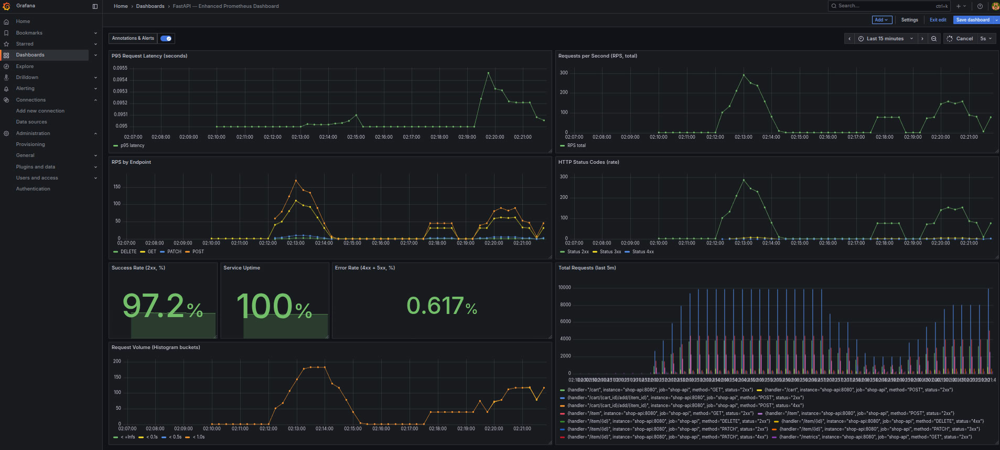

# Monitoring Setup Guide for Shop API

This guide explains how to set up monitoring for the Shop API using Docker, Prometheus, and Grafana.

## Prerequisites

- Docker and Docker Compose installed
- Ports 3000 (Grafana), 8080 (API), and 9090 (Prometheus) available

## Quick Start

### 1. Build and Start Services

```bash
docker-compose up --build
```

This will start three services:
- **shop-api**: The FastAPI application on port 8080
- **prometheus**: Metrics collection on port 9090
- **grafana**: Visualization dashboard on port 3000

### 2. Verify Services are Running

- API: http://localhost:8080/docs
- Prometheus: http://localhost:9090
- Grafana: http://localhost:3000

## Setting Up Grafana

### 1. Login to Grafana

- Navigate to http://localhost:3000
- Username: `admin`
- Password: `admin`
- You'll be prompted to change the password (you can skip this for local development)

### 2. Add Prometheus Data Source

1. Click on the **gear icon** (⚙️) in the left sidebar → **Data Sources**
2. Click **Add data source**
3. Select **Prometheus**
4. Configure:
   - **Name**: `Prometheus`
   - **URL**: `http://prometheus:9090`
   - Leave other settings as default
5. Click **Save & Test** - you should see "Data source is working"

### 3. Create Dashboards


1. Click **+** icon in left sidebar → **Import**
2. Enter data from `settings/grafana_config.json`
5. Click **Import**

## Running Load Tests

To generate traffic for monitoring:

```bash
# Make sure the API is running via docker-compose
python ddoser.py
```

The load test will:
- Create random items
- Query items with various filters
- Create carts
- Add items to carts
- Update and delete items
- Generate traffic across all API endpoints

## Stopping Services

```bash
docker-compose down
```

To remove volumes as well:
```bash
docker-compose down -v
```

## HW done


