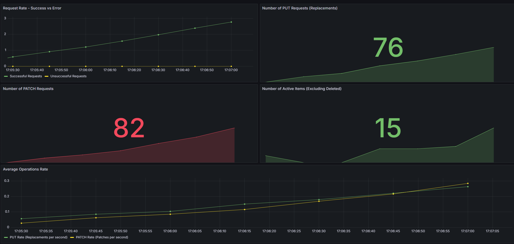

# Домашнее задание №3

Сделано на основе ДЗ2 (API магазина). Создан общий docker-compose.yaml и Dockerfile отдельно для приложения.

Реализован мониторинг следующих метрик с помощью Prometheus и Grafana: количество успешных запросов, количество неуспешных запросов, количество запросов на замену товара (PUT, PATCH), количество имеющихся в базе товаров (с учетом удаленных).

На основе файла с тестами написан скрипт **load_test.py**, который отправляет указанное количество случайных запросов к API на различные эндпоинты.

Пример дашборда:
