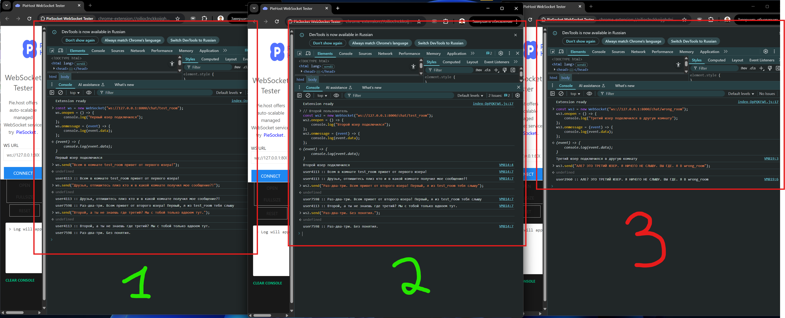
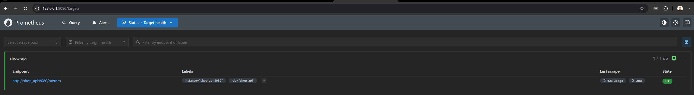
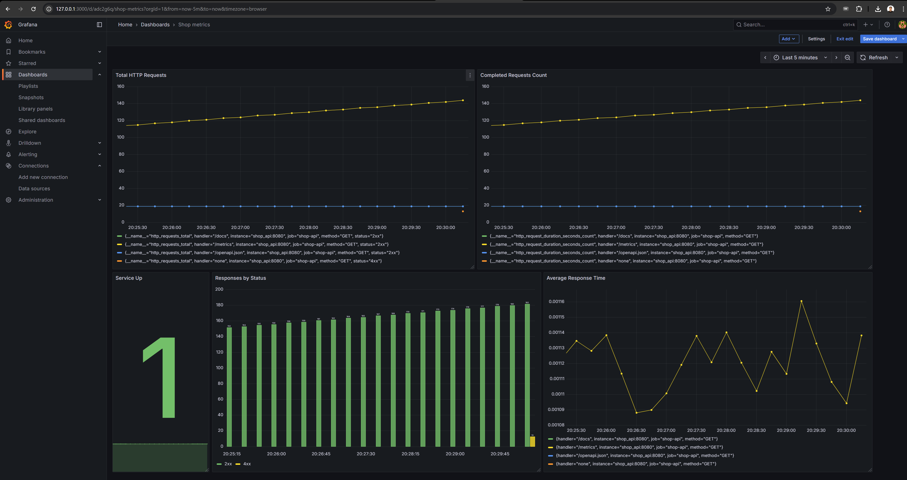

# Shop API

Проект реализует REST API для товаров и корзин, а также WebSocket чат по комнатам.

---

# 🔹 Запустить сервер

## Локально через PowerShell:
```powershell
$env:PYTHONPATH="${PWD}\hw"
uvicorn shop_api.main:app --reload
```

## Через Docker Compose:
```powershell
docker compose up --build
```
- Сервис будет доступен на http://localhost:8080
- Prometheus на http://localhost:9090
- Grafana на http://localhost:3000

# 🔹 Тестирование WebSocket чата

## Через браузер (F12 → Console)
Первый пользователь в комнате test_room
```
const ws = new WebSocket("ws://127.0.0.1:8000/chat/test_room");
ws.onopen = () => console.log("Первый юзер подключился");
ws.onmessage = (event) => console.log(event.data);
```

Второй пользователь в той же комнате
```
const ws2 = new WebSocket("ws://127.0.0.1:8000/chat/test_room");
ws2.onopen = () => console.log("Второй юзер подключился");
ws2.onmessage = (event) => console.log(event.data);
```

Третий пользователь в другой комнате
```
const ws3 = new WebSocket("ws://127.0.0.1:8000/chat/wrong_room");
ws3.onopen = () => console.log("Третий юзер подключился в другую комнату");
ws3.onmessage = (event) => console.log(event.data);
```

Отправка сообщений
```
ws.send("Всем в комнате test_room привет от первого юзера!"); 
ws.send("Друзья, отпишитесь плиз кто и в какой комнате получил мое сообщение?!"); 
ws2.send("Раз-два-три. Всем привет от второго юзера! Первый, я из test_room тебя слышу");  
ws3.send("АЛЕ? ЭТО ТРЕТИЙ ЮЗЕР. Я НИЧЕГО НЕ СЛЫШУ. ВЫ ГДЕ. Я В wrong_room"); 
ws.send("Второй, а ты не знаешь где третий? Мы с тобой только вдвоем тут.");
ws2.send("Раз-два-три. Без понятия.");
```



Мониторинг через Prometheus и Grafana

Скриншоты дашбордов:

Prometheus:


Grafana:
