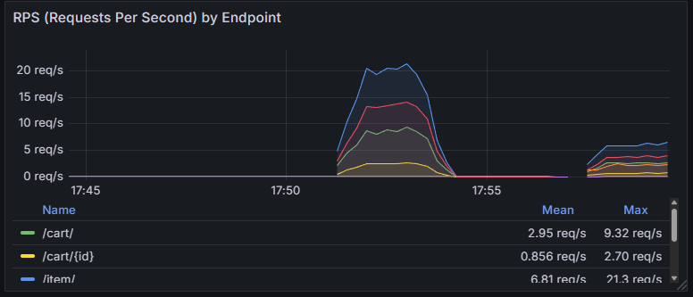
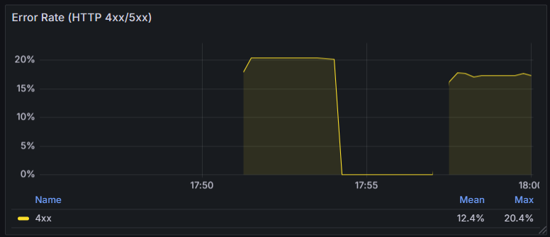
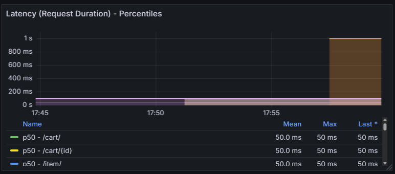
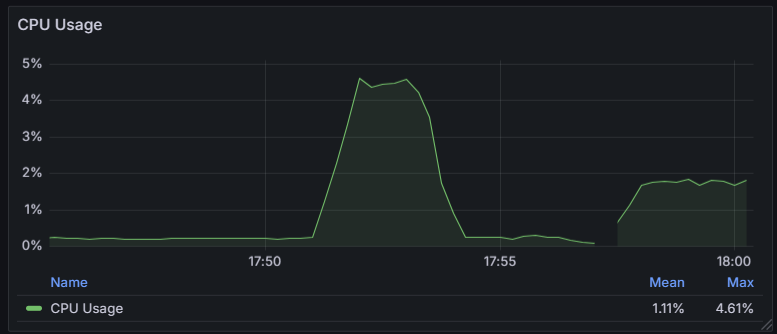
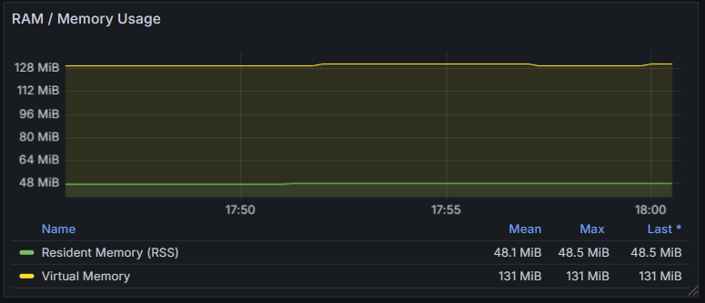
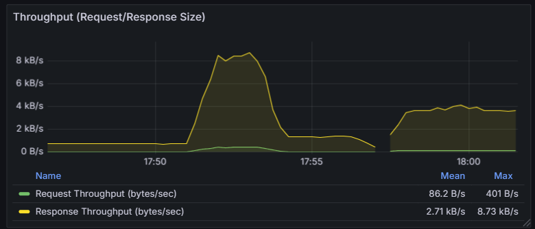
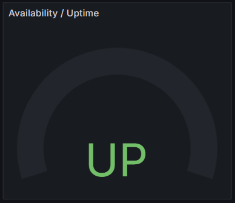
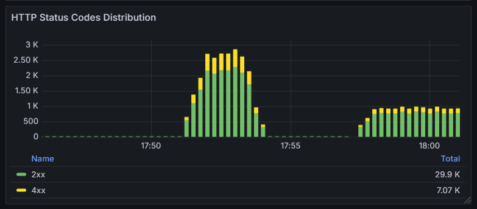
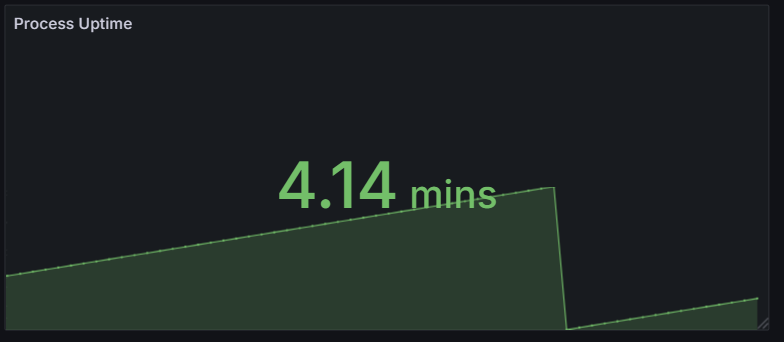

# Shop API

REST API для управления интернет-магазином с поддержкой товаров и корзин покупателей.

## Возможности

- 🛍️ Управление товарами (CRUD операции)
- 🛒 Управление корзинами покупателей
- 📊 Фильтрация и пагинация
- 🗑️ Мягкое удаление товаров
- 📍 REST-совместимые эндпоинты с правильными HTTP статусами

## Технологии

- **FastAPI** - современный веб-фреймворк для создания API
- **Python 3.10+** - с поддержкой type hints
- **Uvicorn** - ASGI сервер
- **Pydantic** - валидация данных

## Установка

```bash
# Установка зависимостей
pip install -r requirements.txt
```

## Настройка базы данных PostgreSQL

Для работы с базой данных используется PostgreSQL через Docker.

### Запуск PostgreSQL

```bash
cd ./python-backend-hw/hw2/hw
docker-compose up -d postgres
```

### Проверка подключения

```bash
psql -h localhost -p 5432 -U admin -d shop_db
```

### Параметры подключения по умолчанию

- **Host:** localhost
- **Port:** 5432
- **Database:** shop_db
- **User:** admin
- **Password:** admin

## Запуск

```bash
# Запуск сервера
uvicorn shop_api.main:app --reload

# Сервер будет доступен по адресу http://localhost:8000
```

## Документация API

После запуска сервера документация доступна по адресам:
- **Swagger UI**: http://localhost:8000/docs
- **ReDoc**: http://localhost:8000/redoc

## API Endpoints

### 📦 Items (Товары)

#### Создать товар
```http
POST /item/
Content-Type: application/json

{
  "name": "iPhone 15",
  "price": 79990.0
}

Response: 201 Created
Location: /item/{id}
{
  "id": 1,
  "name": "iPhone 15",
  "price": 79990.0,
  "deleted": false
}
```

#### Получить товар по ID
```http
GET /item/{id}

Response: 200 OK
{
  "id": 1,
  "name": "iPhone 15",
  "price": 79990.0,
  "deleted": false
}
```

#### Получить список товаров
```http
GET /item/?offset=0&limit=10&min_price=1000&max_price=100000&show_deleted=false

Response: 200 OK
[
  {
    "id": 1,
    "name": "iPhone 15",
    "price": 79990.0,
    "deleted": false
  }
]
```

**Query параметры:**
- `offset` (int, >=0, default: 0) - номер страницы
- `limit` (int, >=1, default: 10) - размер страницы
- `min_price` (float, >=0, optional) - минимальная цена
- `max_price` (float, >=0, optional) - максимальная цена
- `show_deleted` (bool, default: false) - показывать удаленные товары

#### Обновить товар (полностью)
```http
PUT /item/{id}?upsert=false
Content-Type: application/json

{
  "name": "iPhone 15 Pro",
  "price": 99990.0
}

Response: 200 OK
{
  "id": 1,
  "name": "iPhone 15 Pro",
  "price": 99990.0,
  "deleted": false
}
```

#### Обновить товар (частично)
```http
PATCH /item/{id}
Content-Type: application/json

{
  "price": 89990.0
}

Response: 200 OK
{
  "id": 1,
  "name": "iPhone 15 Pro",
  "price": 89990.0,
  "deleted": false
}
```

#### Удалить товар
```http
DELETE /item/{id}

Response: 200 OK
{
  "id": 1,
  "name": "iPhone 15 Pro",
  "price": 89990.0,
  "deleted": true
}
```

> ⚠️ Товары удаляются мягко - помечаются флагом `deleted=true`

### 🛒 Cart (Корзины)

#### Создать корзину
```http
POST /cart/

Response: 201 Created
Location: /cart/{id}
{
  "id": 1,
  "items": [],
  "price": 0.0
}
```

#### Получить корзину по ID
```http
GET /cart/{id}

Response: 200 OK
{
  "id": 1,
  "items": [
    {
      "id": 1,
      "name": "iPhone 15",
      "quantity": 2,
      "available": true
    }
  ],
  "price": 159980.0
}
```

#### Получить список корзин
```http
GET /cart/?offset=0&limit=10&min_price=1000&max_price=500000&min_quantity=1&max_quantity=10

Response: 200 OK
[
  {
    "id": 1,
    "items": [...],
    "price": 159980.0
  }
]
```

**Query параметры:**
- `offset` (int, >=0, default: 0) - номер страницы
- `limit` (int, >=1, default: 10) - размер страницы
- `min_price` (float, >=0, optional) - минимальная цена корзины
- `max_price` (float, >=0, optional) - максимальная цена корзины
- `min_quantity` (int, >=0, optional) - минимальное количество товаров
- `max_quantity` (int, >=0, optional) - максимальное количество товаров

#### Добавить товар в корзину
```http
POST /cart/{cart_id}/add/{item_id}

Response: 201 Created
Location: /cart/{cart_id}
{
  "id": 1,
  "items": [
    {
      "id": 1,
      "name": "iPhone 15",
      "quantity": 1,
      "available": true
    }
  ],
  "price": 79990.0
}
```

## Модели данных

### ItemResponse
```json
{
  "id": 1,
  "name": "string",
  "price": 0.0,
  "deleted": false
}
```

### ItemRequest
```json
{
  "name": "string",
  "price": 0.0
}
```

### PatchItemRequest
```json
{
  "name": "string",  // optional
  "price": 0.0       // optional
}
```

### CartResponse
```json
{
  "id": 1,
  "items": [
    {
      "id": 1,
      "name": "string",
      "quantity": 1,
      "available": true
    }
  ],
  "price": 0.0
}
```

### CartItemInfo
```json
{
  "id": 1,
  "name": "string",
  "quantity": 1,
  "available": true
}
```

## Коды ответов HTTP

| Код | Описание |
|-----|----------|
| 200 | OK - Успешный запрос |
| 201 | Created - Ресурс успешно создан |
| 304 | Not Modified - Ресурс не был изменен |
| 404 | Not Found - Ресурс не найден |
| 422 | Unprocessable Entity - Ошибка валидации |

## Примеры использования

### Python (httpx)
```python
import httpx

# Создание товара
async with httpx.AsyncClient() as client:
    response = await client.post(
        "http://localhost:8000/item/",
        json={"name": "MacBook Pro", "price": 199990.0}
    )
    item = response.json()
    print(f"Created item: {item['id']}")

    # Получение товара
    response = await client.get(f"http://localhost:8000/item/{item['id']}")
    print(response.json())
```

### cURL
```bash
# Создание товара
curl -X POST "http://localhost:8000/item/" \
  -H "Content-Type: application/json" \
  -d '{"name": "MacBook Pro", "price": 199990.0}'

# Получение списка товаров
curl "http://localhost:8000/item/?offset=0&limit=10"

# Создание корзины
curl -X POST "http://localhost:8000/cart/"

# Добавление товара в корзину
curl -X POST "http://localhost:8000/cart/1/add/1"
```

## Структура проекта

```
hw2/hw/
├── shop_api/                      # API магазина
│   ├── __init__.py
│   ├── main.py                    # Точка входа приложения (FastAPI)
│   ├── database.py                # Конфигурация БД (SQLAlchemy)
│   ├── README.md                  # Документация API
│   ├── api/
│   │   ├── __init__.py
│   │   └── shop/
│   │       ├── __init__.py
│   │       ├── routes.py          # HTTP эндпоинты (REST)
│   │       └── contracts.py       # Pydantic модели запросов/ответов
│   ├── data/
│   │   ├── __init__.py
│   │   ├── db_models.py           # SQLAlchemy модели (БД)
│   │   ├── models.py              # Domain модели (dataclasses)
│   │   ├── item_queries.py        # Работа с товарами (PostgreSQL)
│   │   └── cart_queries.py        # Работа с корзинами (PostgreSQL)
│   ├── transaction_scripts/       # Демонстрация уровней изоляции
│   │   ├── README.md              # Документация транзакций
│   │   ├── config.py              # Конфигурация БД
│   │   ├── models.py              # Модели для демонстраций
│   │   ├── 0_dirty_read_solved.py
│   │   ├── 1_non_repeatable_read_problem.py
│   │   ├── 2_non_repeatable_read_solved.py
│   │   ├── 3_phantom_read_problem.py
│   │   └── 4_phantom_read_solved.py
│   └── alembic/                   # Миграции базы данных
│       ├── alembic.ini
│       ├── env.py
│       └── versions/
│
├── tests/                         # 🧪 Тесты (203 теста, 98% coverage)
│   ├── conftest.py                # Pytest фикстуры
│   ├── unit/                      # Unit тесты
│   │   ├── test_contracts.py
│   │   ├── test_db_models.py
│   │   ├── test_routes.py
│   │   └── test_database_config.py
│   ├── integration/               # Integration тесты
│   │   ├── test_item_queries.py
│   │   ├── test_cart_queries.py
│   │   └── test_database_session.py
│   └── e2e/                       # End-to-End тесты
│       ├── test_item_api.py
│       ├── test_cart_api.py
│       ├── test_workflows.py
│       ├── test_edge_cases.py
│       └── test_validation.py
│
├── chat/                          # WebSocket чат
│   ├── __init__.py
│   ├── server.py                  # WebSocket сервер
│   ├── client.py                  # WebSocket клиент
│   └── README.md                  # Документация чата
│
├── settings/                      # Конфигурация мониторинга
│   └── prometheus/
│       └── prometheus.yml         # Конфиг Prometheus (scrape targets)
│
├── assets/                        # Скриншоты дашбордов
│   ├── rps.png
│   ├── latency.png
│   ├── cpu_usage.png
│   ├── ram_usage.png
│   ├── error_rate_4xx.png
│   ├── throughput.png
│   └── https_status_codes.png
│
├── .coveragerc                    # Конфигурация coverage
├── pytest.ini                     # Конфигурация pytest
├── Dockerfile                     # Docker образ для Shop API
├── docker-compose.yml             # Оркестрация (shop + postgres + prometheus + grafana)
├── grafana-dashboard.json         # Готовый дашборд Grafana
├── generate_errors.py             # Скрипт генерации нагрузки и ошибок
└── requirements.txt               # Python зависимости
```

## Мониторинг и метрики

### 📊 Prometheus + Grafana

API автоматически экспортирует метрики в формате Prometheus через эндпоинт `/metrics`.

#### Запуск мониторинга

```bash
# Запуск полного стека (API + Prometheus + Grafana)
docker-compose up --build

# Проверка статуса
docker compose ps
```

**Доступные сервисы:**
- **Shop API**: http://localhost:8080
- **Prometheus**: http://localhost:9090
- **Grafana**: http://localhost:3000 (по умолчанию admin/admin)
- **Metrics endpoint**: http://localhost:8080/metrics

#### Просмотр метрик в Grafana

1. Откройте Grafana: http://localhost:3000
2. Перейдите в **Dashboards** → **Shop API - Performance Dashboard**


----

### Собираемые метрики

---

#### RED метрики (основные для мониторинга SLA)

---

**1. RPS (Requests Per Second)**

Количество запросов, обрабатываемых системой в секунду.




**2. Error Rate**

Доля неудачных запросов (например, HTTP 5xx/4xx ошибок) относительно общего числа запросов.




**3. Latency (Duration)**

Время отклика системы: сколько времени проходит между отправкой запроса и получением ответа.



---

#### USE метрики (системные ресурсы)

---

**4. CPU Usage**

Загрузка центрального процессора.




**5. Memory (RAM)**

Использование оперативной памяти (Random Access Memory). 





---

#### Дополнительные метрики

---

**6. Throughput**

Объём данных или операций, обрабатываемых системой за единицу времени.




**7. Availability**

Показатель доступности сервиса.



**8. HTTP Status Codes**

- Распределение 2xx/4xx/5xx статус-кодов
- История изменений во времени




**9. Process Uptime**

Показатель того, как долго процесс непрерывно работает без перезапуска.



---

### Генерация тестовой нагрузки

Для проверки метрик используйте скрипт генерации запросов:

```bash
# Одиночный burst (быстрый тест)
python generate_errors.py

# Непрерывная нагрузка (5 минут)
python generate_errors.py continuous 300

# Кастомная длительность (10 минут)
python generate_errors.py continuous 600
```

**Что генерирует скрипт:**
- Успешные запросы (2xx) — создание items, чтение списков
- 404 ошибки — запросы несуществующих items/carts
- 422 ошибки — невалидные query параметры
- Медленные запросы — `/item/slow?delay=5` для Active Connections

---

## Транзакции и уровни изоляции

### Демонстрационные скрипты

Проект включает демонстрационные скрипты для изучения уровней изоляции транзакций PostgreSQL. Скрипты показывают проблемы параллельного доступа и способы их решения.

#### Запуск демонстраций

**Вариант 1: Из директории `shop_api`**
```bash
cd ./python-backend-hw/hw2/hw/shop_api

python -m transaction_scripts.0_dirty_read_solved
python -m transaction_scripts.1_non_repeatable_read_problem
python -m transaction_scripts.2_non_repeatable_read_solved
python -m transaction_scripts.3_phantom_read_problem
python -m transaction_scripts.4_phantom_read_solved
```

**Вариант 2: Из директории `transaction_scripts`**
```bash
cd ./python-backend-hw/hw2/hw/shop_api/transaction_scripts

python 0_dirty_read_solved.py
python 1_non_repeatable_read_problem.py
python 2_non_repeatable_read_solved.py
python 3_phantom_read_problem.py
python 4_phantom_read_solved.py
```

## 🧪 Тестирование

### Структура тестов

Проект содержит **203 теста** с покрытием кода **98%**.

```
tests/
├── conftest.py              # Фикстуры (client, db_session)
├── unit/                    # Unit тесты (изолированные)
│   ├── test_contracts.py    # Pydantic модели
│   ├── test_db_models.py    # SQLAlchemy модели
│   ├── test_routes.py       # HTTP handlers (edge cases)
│   └── test_database_config.py
├── integration/             # Integration тесты (с БД)
│   ├── test_item_queries.py     # CRUD операции товаров
│   ├── test_cart_queries.py     # CRUD операции корзин
│   └── test_database_session.py
└── e2e/                     # End-to-End тесты (полный flow)
    ├── test_item_api.py     # REST API товаров
    ├── test_cart_api.py     # REST API корзин
    ├── test_workflows.py    # Бизнес-сценарии
    ├── test_edge_cases.py   # Граничные случаи
    └── test_validation.py   # Валидация входных данных
```

### Запуск тестов

```bash
# Все тесты
pytest

# Тесты с покрытием
pytest --cov=shop_api --cov-report=term-missing

# Только unit тесты
pytest -m unit

# Только integration тесты
pytest -m integration

# Только E2E тесты
pytest -m e2e

# С подробным выводом
pytest -vv

# Проверка минимального coverage (95%)
pytest --cov=shop_api --cov-fail-under=95
```

### Особенности тестирования

#### ✅ Валидация входных данных

API проверяет корректность данных:

```python
# ❌ Отрицательная цена
POST /item/ {"name": "Item", "price": -10.0}
→ 422 Unprocessable Entity

# ❌ Пустое имя
POST /item/ {"name": "", "price": 10.0}
→ 422 Unprocessable Entity

# ❌ Слишком длинное имя (>255 символов)
POST /item/ {"name": "A"*256, "price": 10.0}
→ 422 Unprocessable Entity

# ✅ Корректные данные
POST /item/ {"name": "Valid Item", "price": 99.99}
→ 201 Created
```

#### 🗄️ Тестовая база данных

Тесты используют отдельную PostgreSQL БД:

- **Автоматическое создание/очистка** БД для каждого теста
- **Изолированные транзакции** - rollback после каждого теста
- **Миграции Alembic** применяются автоматически

#### 📊 Coverage отчет

```bash
# HTML отчет
pytest --cov=shop_api --cov-report=html

# Открыть в браузере
open htmlcov/index.html
```

### Типы тестов

#### Unit тесты (`tests/unit/`)
- Тестируют отдельные компоненты
- Используют моки для изоляции
- Очень быстрые (без БД)

#### Integration тесты (`tests/integration/`)
- Тестируют взаимодействие с БД
- Проверяют SQL queries
- Используют реальную PostgreSQL

#### E2E тесты (`tests/e2e/`)
- Тестируют полный HTTP → Routes → Queries → DB flow
- Проверяют бизнес-сценарии
- Максимально близки к реальному использованию

### CI/CD

Тесты автоматически запускаются в GitHub Actions:

```yaml
# .github/workflows/hw5-tests.yml
- name: Run tests with coverage
  run: |
    cd hw2/hw
    pytest --cov=shop_api --cov-report=xml --cov-fail-under=95
```

### Примеры тестов

#### Unit тест (Pydantic валидация)
```python
def test_create_item_with_negative_price():
    with pytest.raises(ValidationError):
        ItemRequest(name="Item", price=-10.0)
```

#### Integration тест (БД операции)
```python
async def test_add_item_to_database(db_session):
    info = ItemInfo(name="Book", price=10.0, deleted=False)
    item = await item_queries.add(db_session, info)

    assert item.id is not None
    assert item.info.name == "Book"
```

#### E2E тест (HTTP API)
```python
async def test_create_and_get_item(client):
    # Создаем товар
    response = await client.post(
        "/item/",
        json={"name": "iPhone", "price": 99990.0}
    )
    assert response.status_code == 201
    item_id = response.json()["id"]

    # Получаем товар
    response = await client.get(f"/item/{item_id}")
    assert response.status_code == 200
    assert response.json()["name"] == "iPhone"
```

### Отладка тестов

```bash
# Запустить конкретный тест
pytest tests/e2e/test_item_api.py::TestItemCRUD::test_create_item

# Остановиться на первом падении
pytest -x

# Показать локальные переменные при ошибке
pytest --showlocals

# Запустить последний упавший тест
pytest --lf

# Интерактивная отладка
pytest --pdb
```