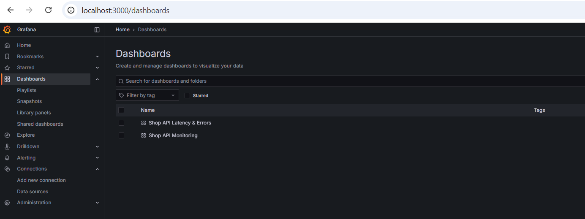
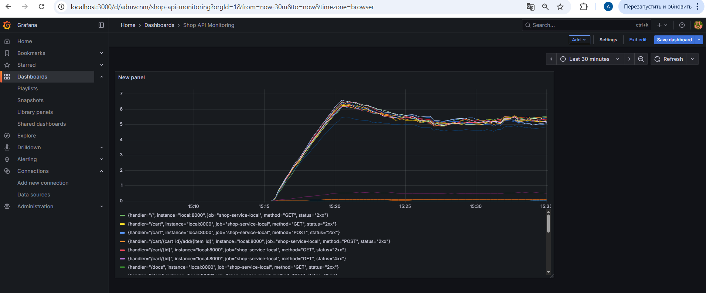
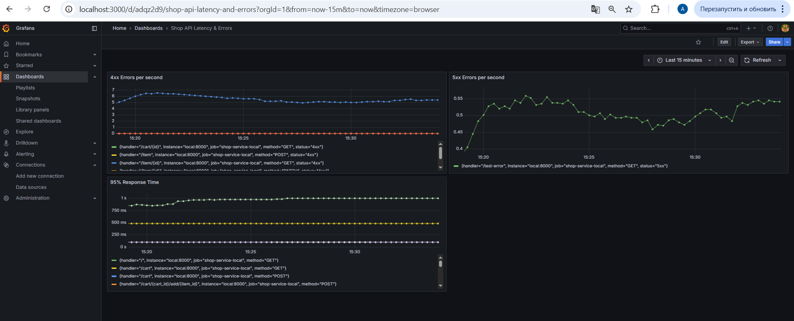
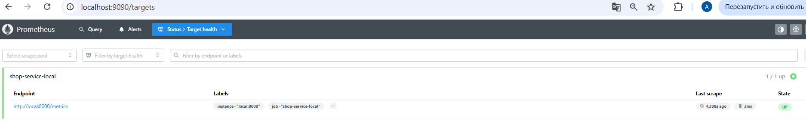
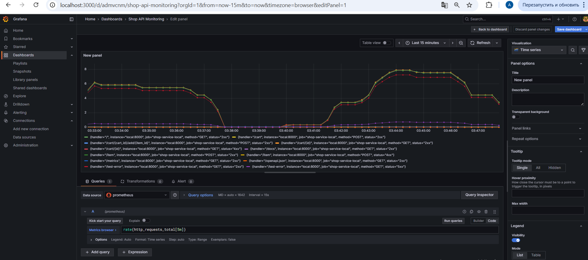
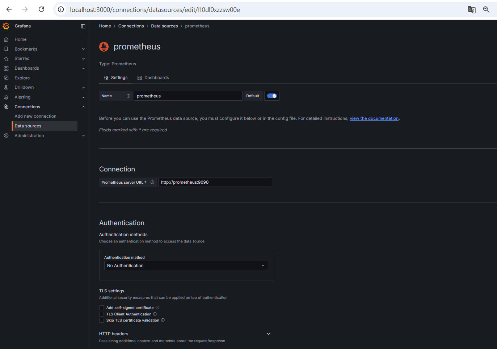
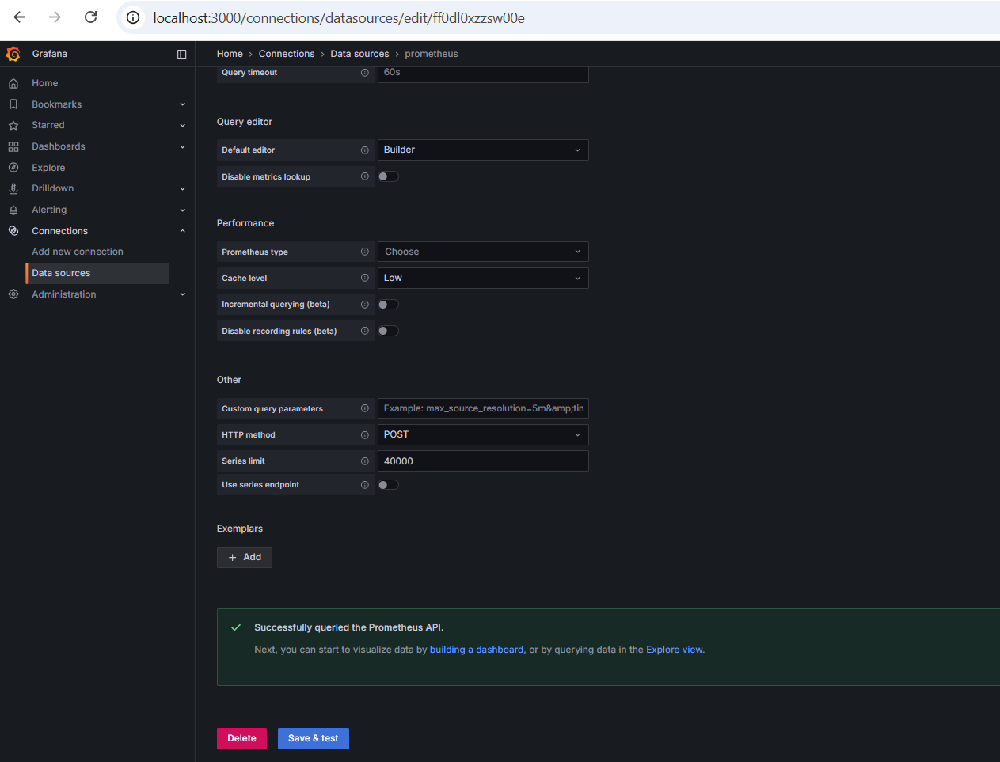

# Shop API с мониторингом

Простой API магазина на **FastAPI** для управления корзинами и товарами, с WebSocket-чатом и мониторингом через **Prometheus** и **Grafana**. 

## Скриншоты

  
*Список дашбордов*    

  
*Скорость запросов, ошибки и задержки API*

  
*95-й перцентиль времени ответа, 4xx/5xx ошибки*



*Проверка Prometheus*     


  
*Пример создания/настройки дашборда* 

  
*Настройка соединения  grafana с Prometheus* 

  
*Настройка соединения  grafana с Prometheus* 


## Описание

Проект реализует REST API для управления корзинами и товарами, WebSocket-чат для общения в комнатах и мониторинг производительности. Метрики собираются с помощью `prometheus-fastapi-instrumentator` и визуализируются в Grafana.

## Структура проекта

- **Dockerfile**: Сборка Docker-образа для FastAPI-сервера (Python 3.12, зависимости, Uvicorn).
- **docker-compose.yml**: Оркестрация контейнеров: FastAPI, Prometheus, Grafana.
- **requirements.txt**: Python-зависимости (`fastapi`, `uvicorn`, `prometheus-fastapi-instrumentator`, `faker`, `requests`).
- **ddoser.py**: Скрипт для нагрузочного тестирования API (создание корзин/товаров, запросы, ошибки).
- **settings/**:
  - **prometheus/prometheus.yml**: Конфигурация Prometheus для сбора метрик (порт 8000).
- **shop_api/**:
  - **client.py**: WebSocket-клиент для тестирования чата.
  - **main.py**: FastAPI-приложение.
  - **models.py**: Pydantic-модели для валидации запросов/ответов.

## Требования

- **Docker** и **Docker Compose**.
- **Python 3.12+** (для локальных скриптов `ddoser.py` и `client.py`).
- Порты: `8000` (API), `9090` (Prometheus), `3000` (Grafana).


## Сборка и запуск

1. **Запуск в фоне (рекомендуется)**:
   ```bash
   docker-compose up --build -d
   ```
   Контейнеры запустятся в фоновом режиме.

2. **Посмотреть логи**:
   ```bash
   # Логи только FastAPI
   docker-compose logs -f local

   # Логи всех сервисов
   docker-compose logs -f
   ```

3. **Перезапуск без пересборки** (если код не менялся):
   ```bash
   docker-compose up -d
   ```

4. **Пересборка только FastAPI** (при изменении кода):
   ```bash
   docker-compose build local
   docker-compose up -d local
   ```

5. **Остановка**:
   ```bash
   docker-compose down
   ```

## Как проверить, что всё работает

- **FastAPI**: [http://localhost:8000](http://localhost:8000)  
  Должен вернуть JSON: `{"message": "Welcome to Shop API! Go to /docs for documentation."}`.
- **Документация**: [http://localhost:8000/docs](http://localhost:8000/docs)  
  Swagger UI для тестирования эндпоинтов.
- **Метрики**: [http://localhost:8000/metrics](http://localhost:8000/metrics)  
  Показывает Prometheus-метрики (например, `http_requests_total`).
- **Prometheus**: [http://localhost:9090/targets](http://localhost:9090/targets)  
  Статус `shop-service-local` должен быть `UP`.
- **Grafana**: [http://localhost:3000](http://localhost:3000)  
  Логин/пароль: `admin`/`admin` (сменитьь пароль при  входе).

## Тестирование

### REST API

- Используйте Swagger UI: [http://localhost:8000/docs](http://localhost:8000/docs)
  - Создайте товар: POST `/item` (пример: `{"name": "Book", "price": 15.99}`).
  - Создайте корзину: POST `/cart`.
  - Добавьте товар в корзину: POST `/cart/{cart_id}/add/{item_id}`.
  - Получите корзину: GET `/cart/{id}`.
  - Тестируйте ошибки: GET `/test-error` (10% шанс HTTP 500).

### WebSocket-чат

- Запустите клиент:
  ```bash
  python shop_api/client.py test_room
  ```
  Введите сообщения в терминале — они отправятся в чат-комнату.

### Нагрузочное тестирование  

Запустите нагрузочный скрипт:
   ```bash
   python ddoser.py
   ```
   Скрипт генерирует:
   - Создание товаров и корзин (POST `/item`, `/cart`).
   - Добавление товаров в корзины (POST `/cart/{id}/add/{item_id}`).
   - Получение корзин/товаров (GET `/cart/{id}`, `/item/{id}`, `/cart`, `/item`).
   - Обновление/удаление товаров (PUT/PATCH/DELETE `/item/{id}`).
   - Ошибки (GET `/test-error`, 10% шанс 5xx, случайные 4xx для несуществующих ID).

## Настройка мониторинга в Grafana

1. **Добавление источника данных**:
   - Откройте Grafana: [http://localhost:3000](http://localhost:3000).
   - Перейтии в *Connections* → *Data sources* → *Add data source*.
   - Выберать *Prometheus*.
   - Указать URL: `http://prometheus:9090`.
   - Нажмите *Save & test* — должно появиться сообщение об успешном подключении.

2. **Создание дашбордов**:
   - Перейти в *Dashboards* → *New dashboard* → *Add visualization*.
   - Выберать  источник данных *Prometheus*.
   - Добавьте панели:
     - **RPS (Requests per second)**:
       - Запрос: `rate(http_requests_total[5m])`
       - Title: `RPS`
       - Unit: `requests/s`
     - **95% Response Time**:
       - Запрос: `histogram_quantile(0.95, rate(http_request_duration_seconds_bucket[5m]))`
       - Title: `95% Response Time`
       - Unit: `seconds (s)`
     - **Ошибки (5xx)**:
       - Запрос: `rate(http_requests_total{status=~"5.."}[5m])`
       - Title: `Server Errors (5xx)`
       - Unit: `errors/s`
     - **Ошибки (4xx)**:
       - Запрос: `rate(http_requests_total{status=~"4.."}[5m])`
       - Title: `Client Errors (4xx)`
       - Unit: `errors/s`
     - **CPU Usage**:
       - Запрос: `rate(process_cpu_seconds_total[5m])`
       - Title: `CPU Usage`
       - Unit: `seconds/s`
   - Нажмите *Apply* для каждой панели.
   - Сохраните дашборд: *Save dashboard* → задайте имя, например, `Shop API Metrics`.

3. **Альтернатива**: Импортируйте готовый дашборд:
   - В *Dashboards* → *Import* введите ID (FastAPI Metrics).
   - Выберите источник данных *Prometheus* и импортируйте.

4. **Заполнение графиков**:
   - Запустить `ddoser.py` для генерации трафика.
   - Обновить дашборд в Grafana — графики покажут запросы, задержки, ошибки.