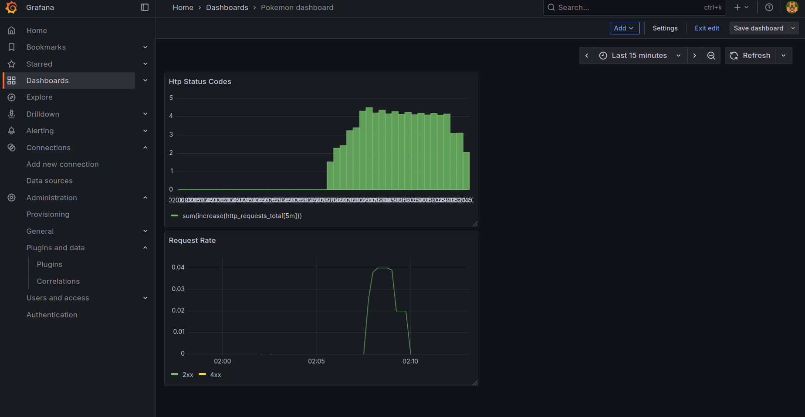

# ДЗ 3

Я пока не выполнил дз 2, поэтому взял указанный пример.

Добавленные файлы:

- *Dockerfile*
- *docker-compose.yml*
- *prometheus.yml*

Обновил код в файле *hw2/rest_example/main.py*

Скриншот из Grafana (*pics/grafana.png*)

