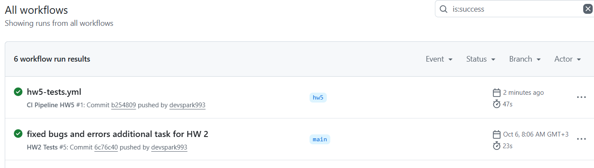

# ДЗ 5, все пункты выполнены
## Shop API

FastAPI-приложение с REST и WebSocket API для интернет-магазина с корзинами, товарами и чатом.

## Скриншоты

  
*Отчет покрытия тестами, 96%*  

  
*Результат CI*  

## Описание

- **REST API**: Управление корзинами (`/cart`) и товарами (`/item`) с фильтрацией.
- **WebSocket**: Чат-комнаты через `/chat/{chat_name}` с трансляцией сообщений.
- **Хранение**: В памяти (словари).
- **Тесты**: Покрытие ≥96% с использованием `pytest`, `pytest-asyncio`, `pytest-cov`.
- **CI**: GitHub Actions с проверкой покрытия ≥95%.

## Требования

- Python 3.12+
- Зависимости: `requirements.txt` (FastAPI, uvicorn, pydantic, pytest, websockets, faker)


## Тестирование

Запустите тесты:


```bash
pytest -vv test_homework2.py
```
Проверка покрытия (≥96%):
```bash
pytest --cov=shop_api --cov-report=term --cov-report=html test_homework2.py
```
Отчёт: htmlcov/index.html

Для WebSocket-тестов может  понадобится запустит сервер:

```bash
uvicorn shop_api.main:app --host 0.0.0.0 --port 8000
```

## Windows:

Настройте pytest.ini:
```
ini[pytest]
pythonpath = .
asyncio_mode = strict
```
Если ModuleNotFoundError:
```bash
set PYTHONPATH=%CD%
```

## CI GitHub Actions:

Запускается на push/pull request в main.    
Устанавливает Python 3.12 и зависимости из requirements.txt.   
Запускает сервер FastAPI в фоне для WebSocket-тестов.   
Выполняет тесты с pytest, проверяет покрытие ≥95%.    
Сохраняет отчёт покрытия (htmlcov) как артефакт.    
Статус пайплайна и отчёты доступны во вкладке Actions репозитория.     
Просмотр результатов: перейдите во вкладку Actions в репозитории на GitHub, выберите workflow CI Pipeline,    
проверьте логи и скачайте артефакт coverage-report для отчёта покрытия.    

## Структура файлов


```text
├── shop_api/
│   ├── __init__.py
│   ├── main.py        # Основной код (REST, WebSocket)
│   ├── models.py      # Pydantic модели
│   ├── client.py      # WebSocket-клиент для тестов (исключён из покрытия)
├── test_homework2.py  # Тесты (≥96% покрытия)
├── requirements.txt   # Зависимости
├── pytest.ini         # Настройки pytest
├── .coveragerc        # Настройки pytest-cov
├── README.md          # Документация


/корень репозитория
├── .github/
│   ├── workflows/
│       ├── hw5-tests.yml     # CI для GitHub Actions
```
### Почему исключён client.py:

Вспомогательный скрипт для тестирования WebSocket, не часть API.   
Исключён через .coveragerc.


## Замечания

Тесты: Используют pytest, pytest-asyncio, pytest-cov, faker, websockets.  
Покрытие: ≥96%.     
CI: Автоматический запуск тестов.  


Проверка: Запусти тесты локально и проверь CI
```bash
uvicorn shop_api.main:app --host 0.0.0.0 --port 8000
pytest --cov=shop_api --cov-report=term --cov-report=html test_homework2.py
```

